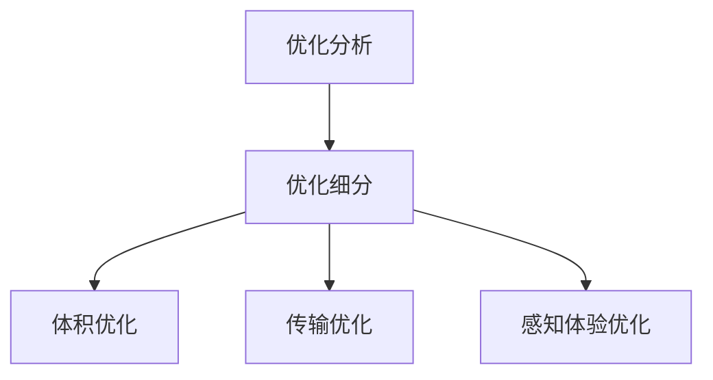

## 浏览器调试工具

### Network

可以看到资源加载详情，初步评估影响`页面性能`的因素。

页面底部是当前加载资源的一个概览：

- `DOMContentLoaded` DOM渲染完成的时间
- `Load`：当前页面所有资源加载完成的时间

### waterfall瀑布流

- `Queueing` 浏览器将资源放入队列时间
- `Stalled` 因放入队列时间而发生的停滞时间
- `DNS Lookup` DNS解析时间
- `Initial connection` 建立HTTP连接的时间
- `SSL` 浏览器与服务器建立安全性连接的时间
- `TTFB` 等待服务端返回数据的时间
- `Content Download` 浏览器下载资源的时间

### Lighthouse

Lighthouse是Google开发的一款开源工具，提供一套全面的测试来评估网页质量，包括加载性能、可访问性、最佳实践和PWA。在chrome 60之后的版本，DevTool里已经内置了Lighthouse。

使用方式：

- 直接在chrome的DevTool中使用

- 使用命令行工具 Node CLI 进行测试 

  ```js
  npm install -g lighthouse
  lighthouse https://www.taobao.com
  ```

- 作为node模块引入代码使用

指标说明：

- `First Contentful Paint` 首屏渲染时间，1s以内绿色
- `Speed Index` 速度指数，4s以内绿色
- `Time to Interactive` 到页面可交换的时间


### Peformance


## 优化逻辑




## 优化分析

### webpack-bundle-analyzer

webpack-bundle-analyzer用来分析webpack项目打包后，内容占比统计；

可以形象的看出依赖项是否过大，有针对性的进行优化。

**分析方向：**

- 体积优化

  - 按需引入（组件库、ICON图标、moment、国际化文件...）
  - 是否有相似的依赖库， 尝试使用同一种依赖库实现相似的功能；（moment/dayjs，组件库）
  - 删除未使用的依赖以及代码冗余

- 传输优化

  - Gzip压缩
  - CDN加速

- 视觉优化（加载动画、骨架屏等）

- 建立前端性能指标

  例如包体积应该要小于多少才是合理的？（当然还有其他指标）。

- 寻求自动化解决方案

  例如在构建完之后获取检查包体积是否符合指标，不符合则进行邮件通知对应的负责人进行优化。
  
  

> 参考资料：
>
> [vue项目优化](https://heapdump.cn/article/3540287)

## 体积优化

### 排查并移除冗余依赖、静态资源

### 构建时压缩图片

image-webpack-loader插件可以处理图片压缩

```js
// install
npm i image-webpack-loader -D
// vue.config.js
chainWebpack: (config) => {
    if (isProd) {
        // 图片压缩处理
        const imgRule = config.module.rule('images')
        imgRule
            .test(/\.(png|jpe?g|gif|webp)(\?.*)?$/)
            .use('image-webpack-loader')
            .loader('image-webpack-loader')
            .options({ bypassOnDebug: true })
            .end()
    }
}
```

### 使用webP图片

> webP是谷歌推出的新图片格式（2010），同等质量**积拳打png脚踢jpg，目前**兼容性还算可以，就苹果家的表现不太理想
>
> **如何转换为webP图片？**
>
> - 手动，可以使用官方 **webP-converter**。
>
> ```js
> ./cwebp -q 75 login_plane_2.png -o login_plane_2.webp
> ```
>
> - 自动化生成，可以使用image-min-webp或其他webpack插件

### 优化SVG图标

引入svg-sprite-loader，封装svg组件；

要实现上述效果，只需要

- 引入svg-sprite-loader

```js
// install
npm i svg-sprite-loader -D
// vue.config.js
chainWebpack: (config) => {
    // SVG处理
    config.module
      .rule('svg')
      .exclude.add(resolve('src/icons/svg'))
      .end()
    config.module
      .rule('icons')
      .test(/\.svg$/)
      .include.add(resolve('src/icons/svg'))
      .end()
      .use('svg-sprite-loader')
      .loader('svg-sprite-loader')
      .options({
        symbolId: 'icon-[name]'
      })
      .end()
}
```

- 创建src/icons/svg并将图标放进去，并通过webpack的require.context自动导入

```js
// src/icons/index.js
const req = require.context('./svg', false, /\.svg$/)
const requireAll = requireContext => requireContext.keys().map(requireContext)
requireAll(req)

// main.js
import '@/icons'
```

- 创建全局组件ca-svg

```js
// src/icons/index.js
import Vue from 'vue'
import CaSVG from '@/components/ca-svg'
Vue.component('ca-svg', CaSVG)

// src/components/ca-svg.vue
<template>
  <svg :class="svgClass" aria-hidden="true" v-on="$listeners" :style="svgStyle">
    <use :xlink:href="iconName" />
  </svg>
</template>
...
// name属性为必须字段，其他size或color可以自由定制
```

### 优化core-js体积

> core-js实际上就是浏览器新API的polyfill，项目是PC端，所以主要是为了兼容IE...

- 调整.browserslistrc

  指定项目需要兼容的版本，让babel和auto-prefix少做点兼容性工作，比如移动端不用兼容IE、iOS6.0以下等等

- 调整useBuiltIns

  项目中默认是`useBuiltIns: 'entry'`将所有polyfill都引入了，导致包比较大。我们可以使用`useBuiltIns: 'entry'`调整下策略，按需引入，项目中没使用到的API就不做polyfill处理了

  ```js
  // babel.config.js
  module.exports = {
    presets: [
      '@vue/cli-plugin-babel/preset',
      [
        '@babel/preset-env',
        {
          'useBuiltIns': 'usage', // entry，usage
          'corejs': 3
        }
      ]
    ],
    plugins
  }
  ```


## 传输优化

### 优化分包策略

可以使用webpack SplitChunksPlugin插件，优化拆包策略。

> 参考资料：
>
> [vue2.x拆包](https://www.jianshu.com/p/a87ea2867e64)

### 优化路由懒加载

SPA中一个很重要的提速手段就是路由懒加载，当打开页面时才去加载对应文件，我们利用Vue的异步组件和webpack的代码分割（`import()`）就可以轻松实现懒加载了。

但当路由过多时，请合理地用webpack的魔法注释对路由进行分组，太多的chunk会影响构建时的速度

```
{
    path: 'register',
    name: 'register',
    component: () => import(/* webpackChunkName: "user" */ '@/views/user/register'),
}
复制代码
```

> 请只在生产时懒加载，否则路由多起来后，开发时的构建速度感人


### HTTP2

多路复用避开了资源并发限制，但资源太多的情况，也会造成浏览器性能损失（Chrome进程间通信与资源数量相关）。

### 客户端提前GZIP

使用 `Webpack的`在客户端提前GZIP的好处是， `Nginx`每次请求服务端都要压缩很久才回返回信息回来，不仅服务器开销会增大很多，请求时间也会变长。

我们在 `Webpack`打包时就直接生成高压缩等级的文件，作为静态资源放在服务器上，这时将 Nginx作为二重保障就会高效很多。


### 


## 加载优化

前端 web 区别于应用端，页面展示不需要提前下载数据，而是当用户打开网页时，才动态增量形式的下载资源；

所以页面的**加载速度**，很大程度影响了一个网站的性能体验；

### 用户预期

大部分的用户其实都期待页面能够在**2 秒内**加载完成，而当**超过 3 秒**以后，就会有接近**40%**的用户离开你的网站；

### 首屏/白屏优化

用户输入 URL 后，到页面渲染完成，这个阶段处于白屏阶段；

首屏下，以 chrome 举例，最大支持 6 个并发请求，也就是初始化同一时间只能保持 6 个请求；

这就会造成如果资源文件过大，会阻塞后面资源的加载，延长首屏加载时间；

- ### 拆分打包资源

  当单个资源（依赖文件）过大时，可以通过`splitChunksPlugin`进行打包文件拆分；

- ### 预渲染

  因为页面会先获取 HTML，然后再读取 HTML 中引入的 js、css 文件，进行请求下载；

  再根据解析后的内容，进行页面绘制；

  所以我们可以进行 HTML 预渲染，这样在获取 HTML 后，就可以进行页面初始化占位展示；

  增加用户体验。

- ### 开启 HTTP2.0

- ### 浏览器缓存

- ### CDN

- ### 压缩文件（Gzip）

## 执行优化

### CSS 动画

- #### 那么如何避免重绘和回流?

  具体而言,就是多使用 transform 或者 opacity 来实现动画效果,上述方法在合成层使用不会引起重绘和回流.
