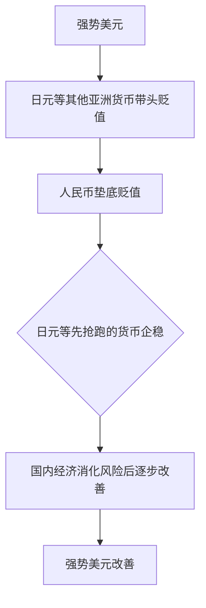

## M0、M1与M2

M0，M1，M2 是货币供应量的三个定义，M 这个字母，就代表了货币（Money）,分别表示三种货币：

- 流通中的现金

  M0 = 流通中现金

  M0 数值高 =》 证明老百姓**手头宽裕、富足**。衣食无忧的情况下这种可能性更高

- 狭义货币

  M1=M0＋企业活期存款

  M1 反映着经济中的**现实购买力**，流动性仅次于 M0。其中活期存款由于随时可以变现（提取），所以流动性和购买力不亚于现钞

- 广义货币

  M2=M1＋准货币（定期存款 + 居民储蓄存款 + 其它存款）

  M2 不仅反映现实的购买力，还反映潜在的购买力。

  流动性偏弱，但**反映的是社会总需求的变化和未来通货膨胀的压力状况**。

  **通常所说的货币供应量，主要指 M2**、

简单说：

M0 相当于你钱包里的钱，

M1 就是钱包里的钱加上银行的活期存款（我国只计算企业的活期存款）

M2 就是前两者再加上定期存款等其他具备购买力的货币形式

### 这些指数如何得出

M0、M1、M2这些指数就是通过二级银行体制下的**央行和商业银行的资产负债表**科目中的数值计算而来

> ### 什么是央行的资产项和负债项
>
> 央行资产项
>
> 

>
> 国外资产类
>
> - 外汇
>
>   指的就是央行口径的外汇占款，即央行从居民或商业银行手中购买外汇而对应投放的人民币。
>
> - 货币黄金
>
>   记录央行在国内和国际市场上购买黄金所投放的人民币。
>
>   在国内市场直接用人民币购买黄金，在国际市场购买黄金利用外汇储备，但换算成人民币。
>
> - 其他国外资产
>
>   主要记录央行持有的国际货币基金组织头寸、SDR 等。
>
> 国内资产类
>
> - 对政府债权
>
>   对政府债权记录的是央行持有的中央政府发行证券，主要是特别国债。
>
> - 对其他存款性公司债权
>
>   指央行对商业银行、政策性银行等其他存款性公司的再贴现、再贷款、逆回购操作和结构性货币政策工具余额。
>
>   对其他存款性公司债权主要记录央行主动投放基础货币的方式，与其他存款性公司资产负债表中的 “对央行负债” 科目对应。
>
> - 对其他金融性公司债权
>
>   其他金融性公司是指除中央银行和其他存款性公司以外的其他金融公司。
>
>   在我国主要包括**信托投资公司、金融租赁公司、保险公司、证券公司、证券投资基金管理有限公司、养老基金公司、资产管理公司、担保公司、期货公司、证券交易所和期货交易所**等。
>
> - 对非金融性公司债权
>
>   主要是央行为支持老少边穷地区经济开发所发放的贷款。
>
> 

>
> 央行负债项：
>
> 

>
> - 储备货币
>
>   即基础货币。
>
>   基础货币包括**货币发行和存款准备金**（又称为其他存款性公司存款）。
>
>   其中货币发行又分为**流通中的货币**（亦为 M0）和**银行库存现金**，
>
>   存款准备金又分为**法定存款准备金**和**超额存款准备金**。
>
> - 不计入储备货币的金融性公司存款
>
>   指除去存款准备金之外金融机构在央行的存款，主要包括两部分内容:
>
>   1. 一部分是金融机构业务往来清算支付所需的资金，
>
>   2. 另一部分是非存款类金融机构向央行缴纳的法定存款准备金。
>
> - 发行债券
>
>   主要是指为回收流动性而发行的央票。
>
> - 国外负债
>
>   主要记录的是央行对非居民的负债，主要形式有
>
>   1. 非居民部门在本国央行存款
>   2. 央行在国外发行央票等
>
> - 政府存款
>
>   上至中央政府国库、下至地方政府国库的财政存款都会记在中央银行资产负债表中的政府存款科目。
>
> - 自有资金
>
>   央行的自有资金是央行资本金，就类似自己的钱存到自己的银行里，在账户上当然会放在负债项，这是银行欠自己的。
>
> - 其他负债
>
>   其他负债主要包括正回购余额、金融机构以外汇形式缴存法定存款准备金等。
>
> 

## 银行体系

我国银行体系实行的是**二级银行体制**，所谓二级银行体制：

就是一个国家由央行成为一级银行，

而商业银行（存款货币银行）是二级银行，商业银行在央行那里开户，

民居（企业和个人）在商业银行那里开户

## 降准和降息

在现代经济体系建立后，银行变成主要的经济和资金载体。国家为了控制整体的货币数量，一般会采用中央银行机制。比如美国的美联储、中国的人民银行。

那么中央银行如何**控制整个国家的货币总量**呢，就是通过**准备金机制**；

## 通胀与通缩

**通胀**

起初，市场上 100 块肉，货币 100 元，1 块肉 1 元。

期间，央行增发 100 元，充足流动性有助于生产力提高，市场增加 60 块肉。

最后，市场上 160 块肉，货币 200 元，1 块肉 1.25 元，通胀率 25%。

**通缩**

起初，市场上 100 块肉，货币 100 元，1 块肉 1 元。

期间，需求降低，人们只愿意拿出 80 元消费。

后来，市场上 100 块肉，货币 80 元，1 块肉 0.8 元，通缩率 20%

再后来，人们看到肉价下跌，期望能在将来以更低的价格买肉，消费意愿继续降低，形成循环。市场流动性逐渐降低，经济会因此而萧条崩溃。

**滞胀**

起初，市场上 100 块肉，货币 100 元，1 块肉 1 元。

期间，央行增发 100 元，经济增长周期性停滞，生产力没有提高。

后来，市场上 100 块肉，货币 200 元，1 块肉 2 元，通胀率 100%。

以上三个事例分别解释了通胀、通缩和滞胀。

**对比三种情况差异**

我们可以发现，这三种情况，只有通胀是比较正面的。

- 通胀虽然物价上涨 25%，但是经济得到了发展，生产力有所提高。

- 通缩环境下，大家消费需求形成恶性循环逐渐下降，经济增长也随之陷入停滞萧条。

  而经济不增长导致大量企业倒闭，失业率上升，民众收入减少，需求进一步降低，恶性循环下最终会走向崩溃。

- 滞胀往往发生在长期通胀后，经济增长也周期性停滞。如果继续增发货币，会导致通胀加剧；如果加息收缩货币，长期处于货币宽松环境下的企业很可能会大规模崩溃。真是进退两难！此时只能靠财政政策刺激来走出困境。

**综上，大家可以发现，长期温和的通胀是比较适宜的经济环境。**

现实中，经济不可能处于长期稳定的状态，也就有了货币宽松、紧缩的周期。而从局部来看，也可能出现结构性通缩、结构性通胀的情况。

而真实的经济环境是通缩、通胀还是滞胀，其实并不能纯看统计数据。只有深处生活中的我们才会有更直观的体会。

那么这三种环境下，如何投资保住自己的财富呢？

- 经济增长我们肯定是要投资股市的，毕竟股票可以认为是经济未来增长的折现。

  另外，就是房产投资，经济增长会带来民众真实购买力和投资需求的提升。

- 货币宽松的情况下，我们要投商品、黄金，生产力少即供给少，而货币供给多，实物价格会上涨。

- 通缩环境下，现金为王，或者投资安全性高的债券，只有货币值钱。

**常见通胀**

在中国主要有三种性质的通胀，

- 第一种只是资源品的上涨，这种所谓的通胀是平民化的通胀，对老百姓影响大；
- 第二种是股市上涨带来的通胀，对中产阶级影响最大；
- 第三种是豪宅的价格上涨，豪宅的价格可以作为通胀指标，如果豪宅涨的比较多，相当于是富豪出现通胀了。

## 印花税

**印花税是对经济活动和交往中书立、领受、使用的应税凭证征收的一种税。**

简单解释字面意思，印花即图章、印章。 对文件上盖的的图章征税，也就是例如若房产证文件上盖了公章，就证明此文件受法律保护、合法有效。那你就需要缴纳印花税。

### 股票印花税

股票交易印花税是从普通印花税发展而来，是专门针对股票交易发生额征收的一种税。

**股票交易印花税是政府增加税收收入的一个手段。**

国家税务总局决定从２００８年４月２４日起，调整证券（股票）交易印花税税率，由现行３‰调整为１‰。即对买卖、继承、赠与所书立的Ａ股、Ｂ股股权转让书据，由立据双方当事人分别按１‰的税率缴纳证券（股票）交易印花税。**也就是卖股票要支付千分之一的印花税。**

## 国债

当你的支出超过你的收入时，这种类型的支出被称为赤字支出。政府也面临着同样的困境，他们也会出现赤字，或者以未来的收入为抵押进行借贷，以满足国民现在更多的需求 。

例如美国联邦政府通过向 “公众” 出售美国国债 (票据和债券) 来借款；

### 信用风险

信用风险是借款人不偿还贷款给贷款人的风险。它是借款人支付利率的一个组成部分。

与所有贷款一样，美国国债的利率反映了违约风险。

**违约风险越高，投资者预期的利率就越高**：在其他条件相同的情况下，被视为较高信用风险的国家必须向债券持有人支付比被视为较低信用风险的国家更高的利率。

因此，**当债券收益率飙升时，可能反映了风险的上升**。

### 债券收益率

因为债券价格的变动而计算得出——如果某个债券收益率暴涨，

常常意味着这个债券偿付能力有问题，价格自然就是暴跌！

以国债为例，一般来说有 5 种收益率：

1. **名义收益率：**

   通常称之为**票面利率**，这是国债一开始发行就确定的收益率。

   > 例如：
   >
   > 某 10 年期中国国债，面值 100 元发售，每年支付一次利息，持有人每年某个固定日期都会从财政部收到 5 元钱的收益，这就意味着名义收益率 5%。

2. **即期收益率：**

   意思是按照当前的国债价格和票面收益算出来的收益率。

   > 例如：
   >
   > 某十年期中国国债，面值 100 元，票面利率 5%，而当前市场价格 96 元，
   >
   > 那么，即期收益率 = 5/96=5.2%。

3. **到期收益率：**

   这个稍复杂一点儿，要考虑当前债券价格和持有到期后财政部返还所有本息的**价差**和距离到期的**剩余年份**。

   通常在财经新闻中听到的那个 “**国债收益率**” 或“**债券收益率**”，通常情况下就是指 “到期收益率”！

   > 例如：
   >
   > 某十年期中国国债，面值 100 元，票面利率 5%，当前市场上价格 96 元，还有 8 年到期，那么，到期收益率 =[5+（100-96）/8]/96=5.73%。

4. **认购者收益率：**

   在绝大多数时候，100 元面值的国债，财政部是不会按照 100 元来卖的，而是要根据当前市场上的国债收益率价格进行调整，还要根据各购买国债的金融机构投标情况来确定价格。

   这个收益率，指的是认购者买国债之后，持有到期的收益率。这需要考虑财政部出售债券价格、本来的票面收益率等因素。

   这个收益率，就是通常所谓的 “**国债发行利率**"

   >例如：
   >
   >某十年期中国国债，面值 100 元，票面利率 5%，购买者从财政部购买的价格是 102 元，那么，认购者收益率 =[5+（100-102）/10]/102=4.71%。

   　　

5. **持有期收益率：**

   国债价格本身有涨跌，有人就会想着在涨涨跌跌中赚差价，而这个收益率就是在你赚取差价时候的收益率。

   这个收益率，就是**投资者买卖债券所获取的投资收益率**。

   > 例如：
   >
   > 某十年期中国国债，面值 100 元，票面利率 5%，每年付息一次。
   >
   > 我以 96 元在年初买进，除了获得国债利息收入外，我还预计 2 年后会涨到 102 元，并在那时卖出，这样一来，持有期收益率 =[5+（102-96）/2]/96=8.33%。

### 国债与资产

不考虑通胀的话，影响方向很确定：

- 国债下移，资产价格上升
- 国债上移，资产价格下跌

因为有中央政府和央妈印钞作保证，**10 年期国债的收益率通常被称为 “无风险收益率”**——也就是说，购买 10 年期国债，我的收益率是不用承担风险的；

与无风险收益率相对，一个人如果购买非国债的其他债券、股票、房子等资产，他需要承担价格涨跌风险，当然也要求获得比国债更高的收益率，所以：

**10 年期国债收益率，就成为了各类资产收益率的铁底。**

如果国债收益率升高，将意味着债券收益率、股票的收益率（市盈率的倒数）、期货升贴水率、房子收益率（租金房价比）的底部都要抬高，这一抬高不要紧，在同样收益（债券票面收益、公司股票分红、房产租金等）的情况下，**将意味着债券、股票、房子的价格的下跌（原理与前面讲债券价格下跌一样）**

否则的话，如果这些资产的收益率比无风险利率还要低，金融机构肯定选择卖出股票、卖出房子、卖出债券——归根结底还是会导致资产价格下跌。

> [国债讲解](http://bond.jrj.com.cn/2017/10/24072123274433.shtml)

## QE

QE （Quantitative Easing，量化宽松）指央行通过购买债券、银行金融资产等做法向市场注入流动性。

QE 是比较新的政策手法，主要是透过央行来收购如国债或优质企业债等资产的方式，**透过增加买家与需求的方式来进一步压低市场利率**，同时因为政府出手买的资产必定是经过较严格评估的商品，所以也可以**拉抬投资市场的信心**。

也通常会被解读为印钞的主因是央行购买公债的举动，就是政府一手印国债来筹资，另一边的央行却同时印钞票来买进国债，很像是央行直接把钱给政府花一样。

也就表示市场上多出了这麽多资金在流动。

**目的**

1. 把短期利率（1 年以内）压到极低的水准
2. 推动股市热潮
3. 提升民间消费

**风险**

1. 央行出资购债将会扭曲原有的市场机制
2. 用担心过度发债造成无人购买，产生了过度借贷的问题

## Taper

 taper，本意为 “逐渐减小”，在此语境下是**指央行逐渐缩减资产购买规模，逐步退出 QE，收回 QE 向市场投放的流动性。**

## PPI/CPI

结合来看PPI 可以视为领先指标，CPI 可以视为滞后指标

- CPI 

  即消费者物价指数（consumer price index），是反映与居民生活有关的产品及劳务价格统计出来的物价变动指标，**通常作为观察通货膨胀水平的重要指标。**

  如果消费者物价指数升幅过大，表明通胀已经成为经济不稳定因素，央行会有紧缩货币政策和财政政策的风险，从而造成经济前景不明朗。

  > 例如，在过去 12 个月，消费者物价指数上升 2.3％，那表示，生活成本比 12 个月前平均上升 2.3％。当生活成本提高，你的金钱价值便随之下降。
  >
  > 一般说来当 CPI>3% 的增幅时我们称为 INFLATION，就是通货膨胀；
  >
  > 而当 CPI>5% 的增幅时，我们把他称为 SERIOUS INFLATION，就是严重的通货膨胀。

- PPI

  即**生产者物价指数**或者说是**产品价格指数**（Producer Price Index）。

  简单的讲，**如果把企业看成人，企业的生活成本就是 PPi。**

  PPI 反映的是上游产品的价格，如果 PPI 上涨，那么企业会想方设法将上升的成本转嫁到消费品上，从而导致 CPI 的上涨。

- CPI/PPI剪刀差

  

## 美联储加息

美联储加息调整的是「美国联邦基金利率」，英文叫「Federal funds rate」，就是银行向美联储借钱时的利率，通俗讲就是假如银行没钱了，和银行之间借钱时支付的利率。

如果所有银行都没钱了，互相之间借不出来，只能问美联储借时，所支付的利率，这个就是「美国联邦基金利率」了。

**这个利率提高了，银行获得资金的成本就高了，大家从银行贷款的利息也就高了，这会在经济生活中引起连锁反应。**

> 确定这个利率水平的职能部门是美联储旗下的联邦公开市场委员会 (Federal Open Market Committee)，简称 FOMC。
>
> 一般这个委员会有 12 个人，他们分别由政府指定的和联储银行的人组成，美联储主席肯定是其中之一。
>
> 每隔 6 周 FOMC 就会在华盛顿开一次会，这个会议就是财经领域关注度极高的「议息会议」，一般情况下选在周二、周三开两天，一年有 8 次。
>
> 所以，和美联储加息一样，这个会议一直牵动着全球的神经。

## 人民币汇率

我国市场应用了强制结汇制度，是不允许美元流通的，美元必须换成人民币，同时因为外汇管制，所以在岸人民币汇率并不能反映市场的真实供需。

导致人民币汇率包含**在岸人民币汇率**和**离岸人民币汇率**；

- **在岸人民币汇率**

  指**中国大陆的人民币即时汇率**，中国人民银行授权中国外汇交易中心公布在岸人民币汇率；

- **离岸人民币汇率**

  离岸人民币市场是指海外，可经营人民币业务的市场汇率； 

  离岸人民币是指在中国境外经营人民币的存放款业务。

  不施加任何调控手段，离岸人民币比较自由，所以本质上离岸人民币的汇率反映了实际上的供需关系。

> 目前主要的人民币离岸市场在香港，
>
> 新加坡、伦敦、台湾也在积极发展人民币离岸市场。
>
> 一般来说，国外希望人民币大幅升值，这样有利于打开中国市场；但国内希望增加出口，所以离岸汇率高于在岸汇率。

### 离岸市场

香港作为离岸人民币的主要市场，初始功能是对贸易资金交换。但随着人民币升值预期加强，这个市场越来越变成套利市场。

- 预期人民币升值

  离岸汇率上升
  
-  预期人民币贬值

离岸汇率下降

还是那个道理

1. 当同样一个东西有不同的需求时就会产生不同的价值；
2. 当同一个东西（或可互相转换）有不同价值时，就存在套利空间；

> 例如：
>
> 我在深圳的银行里用 6 万人民币兑换 1 万美元，而在香港这一万美元可以兑换成 6 万 1 人民币，中间的差价就是套利空间；
>
> 源源不断的人这么操作来获利，所以最终的价差就会被抹平。

## 外汇存款准备金率

> 外汇准备金率调整的历史及其背景：
>
> 2004 年10 月29 日，中国人民银行关于印发《关于〈金融机构外汇存款准备金管理规定〉的通知》，决定从2005 年1 月15 日起，金融机构外汇存款准备金率统一调整为3%。后于2006 年9 月15 日上调外汇存款准备金率至4％，后又于2007 年5 月8 日上调外汇存款准备金率至5％。
>
> 央行决定自 2021 年 6 月 15 日起，上调金融机构外汇存款准备金率 2 个百分点，即外汇存款准备金率由 5% 提高到 7%。
>
> 自 2021 年 12 月 15 日起，上调金融机构外汇存款准备金率 2 个百分点，即外汇存款准备金率由现行的 7% 提高到 9%。
>
> 当时上调外汇存款准备金率的背景是外汇占款大幅流入以及人民币持续大幅升值。04～07年是WTO 后中国加入全球产业链、出口占比持续提升、经济增速和体量大幅增加背景下的汇率体现。

**原理**

提高外币准备金率**本质是增加金融机构被动持有外币存款资产要求**，这一方面增加商业银行向居民和企业购汇的意愿，另一方面提高商业银行向央行结汇的意愿，最终降低金融体系的外币信用杠杆率，减少外币信用派生能力，从而减少外币信用扩张带来美元回流的结汇压力。

换个视角，这**相当于收紧国内金融体系的外币流动性，外币利率提升，增加外币吸引力从而减少结汇压力。**

上调外汇存款准备金率相当于在外汇市场上收紧美元供给和流动性，从而可以减轻人民币升值的压力，有助于人民币对美元汇率保持在合理均衡水平上的基本稳定。

一般为应对升值，可以选择

1. 收紧外币，
2. 也可以选择放松本币（人民币）。

## 正/逆回购

**正回购：**

意思是你把东西抵押给别人获取资金，然后到期之后你再把你的抵押品赎回（先卖后买）；

对应到央行的操作上面就是，央行看到各大金融机构目前手头比较宽裕，手头比较宽裕，怕他们乱花钱，于是央行就把抵押品（通常是央票）抵押给金融机构，从金融机构当中获取资金。

这就相当于从市场把钱给收回来了。所以**正回购=央行回笼资金=收回流动性。**

**逆回购：**

央行看到金融机构最近比较缺钱，然后就对金融机构说，你把央票抵押给我，我给你放点贷。

所以央行就从金融机构手里面把央票“买”回来，把钱给金融机构，这样一来就相当于把钱投放到市场当中去了。到期之后再把央票“卖”给金融机构，把钱收回来。

所以**逆回购=央行放出资金=释放流动性。**

## SLF/PSL/MLF/SLO

- **SLF**

  借鉴国际经验，中国人民银行于2013年初创设了常备借贷便利（Standing Lending Facility）。

  主要功能是满足金融机构期限较长的大额流动性需求。

  特点：

  1. 由金融机构主动发起，金融机构可根据自身流动性需求申请常备借贷便利；
  2. 常备借贷便利是中央银行与金融机构“一对一”交易，针对性强；
  3. 常备借贷便利的交易对手覆盖面广，通常覆盖存款金融机构。

- **MLF**

  MLF(Medium-term Lending Facility)即中期借贷便利；

  虽然期限是3个月，临近到期可能会重新约定利率并展期。各行可以通过质押利率债和信用债获取借贷便利工具的投放。

  MLF要求各行投放三农和小微贷款。目前来看，央行放水是希望推动贷款回升，并对三农和小微贷款有所倾斜。

  市场人士认为，由SLF向MLF转变，标志着央行货币政策正从数量型为主向价格型为主转变。

- **PSL**

  抵押补充贷款（PSL，即Pledged Supplementary Lending的缩写）；

  在我国，有很多信用投放，比如基础设施建设、民生支出类的信贷投放，往往具有ZF一定程度担保但获利能力差的特点；

  如果商业银行基于市场利率水平自主定价、完全商业定价，对信贷较高的定价将不能满足这类信贷需求。

  **央行PSL所谓引导中期政策利率水平，很大程度上是为了直接为商业银行提供一部分低成本资金，引导投入到这些领域。这也可以起到降低这部分社会融资成本的作用。**

- **SLO**

  短期流动性调节工具（Short-termLiquidityOperations）；

  简单来说就是**超短期的逆回购**。这是央行引入的新工具。

  对于SLO，央行如此介绍：

  以7天期以内短期回购为主，遇节假日可适当延长操作期限，采用市场化利率招标方式开展操作。人民银行根据货币调控需要，综合考虑银行体系流动性供求状况、货币市场利率水平等多种因素，灵活决定该工具的操作时机、操作规模及期限品种等。该工具原则上在公开市场常规操作的间歇期使用。

  

## 现货/期货

### **现货市场 (Spot Markets)** 

现货交易包括**现金交易**和**固定方式交易**；

- 现金交易是指成交日和结算日在同一天发生的证券买卖（一手交钱、一手交货）; 

  例如股票，现货交易是证券交易中最古老的交易方式。**它是指股票的买卖双方，在谈妥一笔交易后。马上办理交割手续的交易方式**，即卖出者交出股票，买入者付款，当场交割，钱货两清。

- 固定方式交易则是指成交日和结算日之间相隔几个交易日，一般在七天以内，目前现货市场上的大部分交易均为固定方式交易

### **期货市场（Futures Markets）**

期货，一般指期货合约，是由期货交易所统一制定的、规定**在将来某一特定的时间和地点交割一定数量标的物的标准化合约**。（这个标的物，又叫基础资产，可以是某种商品，如铜或原油，也可以是某种金融资产，如外汇、债券）

期货市场是相对现货市场而言的，是在现货远期合约交易的基础上发展而来。

期货是现在签订交易合约，但是在将来进行交易。

> 最初的期货交易源於 16 世纪的日本大阪，在日本的大米市场得到了发展，後来渐渐被全世界效仿。

期货最原始的功能并非价值发现，而是**避险**。

期货的英文为 Future 意即未来，在实际的生产经营过程中，为避免商品价格的千变万化导致成本上升或利润下降，**可利用期货交易进行套期保值**。

> **套期保值：**
>
> 即在期货市场上买进或卖出与现货市场上数量相等但交易方向相反的期货合约，使期货和现货市场交易的损益相互抵补。锁定企业的生产成本或商品销售价格，保住既定利润，回避价格风险。

期货和现货最大的区别在于
- 保证金

  期货双方需要支付保证金，防止其中一方毁约

  > 例如：
  >
  > A同B签订一份合约，A以当日1000元/吨的价格，在一年后从B处买入一吨米；
  >
  > 当过去三个月后，米价跌至900元时，A完全可以撕毁合约，因为现在可以900元买到更便宜的米。
  >
  > 所以需要保证金来维护合约。

- 保证金即日结算

  保证金需要动态调整，否则当合约标的价格波动超出保证金时，还是会有毁约发生

  > 例如，接上例：
  >
  > A和B为了签订合约时，约定保证金为100元。
  >
  > 且当米价跌到900元时，此时A已经亏损了100元，若米价再下跌，他的损失金额就超过了自己的保证金100，他又会选择毁约。
  >
  > 所以保证金即日清算制度是：当米价跌幅损失已经等于保证金额度时，A就需要再额外补充保证金到200，来避免他可能存在的毁约风险。
  >
  > 否则当他毁约时，这100元保证金就会支付给B；
  >
  > 

- 到期后通常不用实物交割

  到期后，可以通过买入/卖出合约来代替实物交割

  > 例如，接上例：
  >
  > 当A不想要这1吨米时，因为有合约在身（此时米价1050元/吨），毁约会损失保证金100；
  >
  > 所以A可以和其他买家C签订一份卖出合约，约定在自己的买入合约到期时交割。
  >
  > 这样自己的卖出/买入合约抵消，若卖出合约价格高于买入，那么其中的价差反而是自己的利润。

**对应的期货操作名词**

- **建仓**

  A买了B米的期货合约

- **持仓**

  A持有米的期货直到合约到期

- **交割**

  合约到期的时候，A交钱从B换米

- **平仓**

  在合约到期前，A把这张合约（米）卖给其他人C

## 戴维斯双击/双杀

> 股价 = 每股收益 * 市盈率
>
> P=EPS*PE
>
> 所以股价受到企业盈利和企业估值产生的乘数效应的影响。

- 戴维斯双击

  指的是以低市盈率买入潜力股票，待成长潜力显现厚，以高市盈率卖出，这样可以**尽享 EPS 和 PE 同时增长的倍乘效益。**

  俗称越涨越买！

- 戴维斯双杀

  因为 PE 和股民的预期相关，若股价下跌，同时导致了 PE 降低，

  但由于此时股民的预期很低他们依然会觉得此时的 PE 过高，还会急需看空。

  **在这过程中 EPS 和 PE 双降，而股价降低的幅度是两者的乘积，故称 “戴维斯双杀”。**

  俗称越跌越卖！

> 什么是市盈率PE？
>
> 市盈率（简称 PE）是最常用来评估股价水平是否合理的指标之一，由股价除以年度每股盈余（EPS）得出。
>
> 什么是EPS？
>
> 每股收益（earnings per share, 简称EPS)。
>
> EPS=公司净利润/总股本

## 跨期套利

合约会根据市场情绪，不同时间周期的合约会表现不一样的价格；

- 长期看涨，则远期合约价格上涨
- 长期看衰，则远期合约价格下降

同时买入/卖出同一商品的远期/近期合约，若建仓时其中的价差很大，待价差恢复则可平仓套利；

**本质上，套利所得利润，就是价差的变化区间，和商品价值无关；**

- **多头套利**

  当远期合约价格高于近期合约时（长期看涨情绪），例如价差100；

  可同时买入远期合约（例如1000），卖出近期合约（900）；

  当以后价差变为200时，例如远期合约1150， 近期合约950；

  此时平仓，卖出远期合约（150=1150-1000），买入近期合约（-50），获利100元；

- **空头套利**

  继续上例，若远期合约-近期合约价差为200时，我们建仓卖出远期合约（1150），买入近期合约（950）；

  当以后价差缩小为100时，例如远期合约1200， 近期合约1100；

  此时平仓，买入远期合约（-50=1150-1200，卖出近期合约（150=1100-950），获利100元；

## 熊猫债券

按照国际惯例，境外机构在一个国家的国内市场发行本币债券时，一般以该国最具特征的元素命名，例如**日本 “武士债券”、美国 “扬基债券”、英国 “猛犬债券”** 等。

**从此注册地在境外的机构，依法在中国境内发行的、约定在一定期限内还本付息的、以人民币计价的债券就被命名为 “熊猫债”。**

> 首个熊猫债券发行于2005年10月，由国际金融公司和亚洲开发银行所发行。
>
> 他们的条件为收益率3.4％的113亿10年期人民币国债，和收益率3.34％的10亿10年期人民币国债。

**意义**

之前国际投资者需要在国外募集外币债券，再将资金通过银行以外债转贷款形式，贷款给中国国内企业，此举包含汇率风险。

当熊猫债出现，国际投资者可以直接在国内募集人民币债券，并直接投资中国企业。

作为跨境投融资工具之一，熊猫债意义：

- 优化人民币跨境循环
- 稳妥推进人民币国际化进程

熊猫债市场的积极发展，既为境外发行人拓宽融资渠道、优化债务结构提供了增量基础，也给境内外投资者多元化人民币资产组合配置提供了一个重要选择。

## OTC

## 日元货币战

面对美元的加息，扛着不加息的除了周期错配的中国，另一个扛着不加息的，是**日本**。

日本因为持续的宽松撒币，已经开始在贬值的路上狂奔了，但日元的主动贬值，其实2015年就有过上演。

> 2014年的时候，美联储正好停止QE（量化宽松），于是**美元开始升值走强**。
>
> 同为亚洲经济体，日本的经济操作喜欢把风险丢出去，尤其是丢给邻国，俗称**「以邻为壑」**。
>
> 于是，日元在当时政府宽松政策的引导下，进行**竞争性贬值**。也就是货币战。

为什么要竞争性贬值？

因为亚洲这一圈儿国家，有着类似的**「出口导向」**的贸易结构，某种程度上属于竞争对手。

所以这时候日本突然决定要打价格战，把自己的货币贬值成白菜价，因为日本出口产品本身就很有竞争力，加上日元贬值，日货就更有性价比。那么**周边其他国家往往被迫也会跟着贬值、加入这场商战。**

### YCC

日本是通过**「收益率曲线控制政策」（YCC）**来控制利率的，会把短期利率控制在-0.1%附近、10年利率控制在0%附近、上限控制在0.25%。

只要利率出现偏离，日本央妈就会出手购买国债，控制住这个利率，以此来实现宽松。

**日本の通胀/通缩**

相比通胀，日本更害怕通缩。**日本的政府和私人部门的负债都比较高**，这就决定了它不敢轻易做出提高利率的举动，否则要还的利息更高了，整个社会负担不起。

### 日元贬值周期

