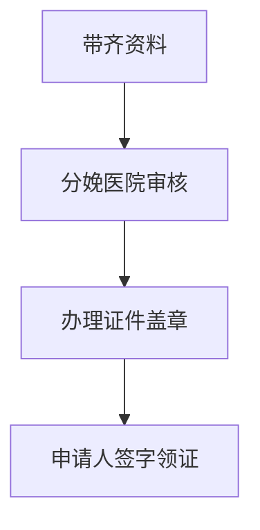
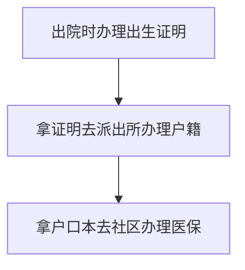

## 出生证明

需要资料：

1. 医院提供的**《出生医学证明 - 首次签发登记表》**
2. 新生儿父母**身份证（户口本）**，原件及复印件；
3. 新生儿起好，上户口的**姓名**（一经打印，不做更改）；
4. 出生**30天内**必须办理；（若超30天，则需提供未按时领取的情况说明）
5. **若领证人不是新生儿母亲**的，还需提供：
   - 新生儿母亲的签字委托书；
   - 新生儿父母身份证原件、复印件；
   - 领证人的本人身份证原件、复印件；

注意事项：

1. 《出生医学证明》由接产医院在婴儿出院前发放；
2. 领证后，及时查看相关信息，如有打印错误应立即让医院重新换发；
3. **后续凭《证明》到婴儿父母一方户籍所在地派出所为婴儿办理户籍登记手续。**

流程：

## 新生儿医保

2022年1月1日起，**新生儿出生90天内**由监护人在**新生儿户籍所在地或居住地的税务部门**，使用新生儿本人**真实姓名和身份证明**缴纳出生当年医疗保险费;待遇享受期为出生之日起至出生当年12月31日。

参保地点：

**户籍（居住证）所属社区或村委会**参加首次基本居民医保

携带资料

1. 新生儿须提供**户口本**；
2. 填写《市城乡居民基本医疗保险参保登记表》

## 总体出生证件办理顺序流程

## 疫苗

**儿童从出生到学龄前期，是免疫系统最脆弱的阶段**，世界上各个国家和地区根据当地的疾病流行情况和经济条件，为该阶段的儿童都制定了不同的免疫规划策略。

及时办理预防接种证：

1. 一般情况下，儿童出生后1个月内，监护人应携带儿童出生时医院提供的《新生儿首剂乙型肝炎（乙肝）疫苗和卡介苗预防接种登记卡》到其居住地预防接种单位建立儿童预防接种证。同时，儿童入托、入园、入学或出境时须查验预防接种证。

我国将疫苗分为两类：

- 政府免费疫苗

  政府免费向公民提供，公民应该依照政府规定受种的疫苗，也称**免费疫苗（官方名字叫“免疫规划疫苗”）**。

  外来儿童和本地儿童享有同样的接种权利，**只要没有禁忌症，都应该及时给孩子接种**。此类疫苗如果不接种，可能会影响宝宝入托、入园、入学。

  > 出生：乙肝疫苗：第1剂，卡介疫苗：第1剂。
  >
  > 1月龄：乙肝疫苗：第2剂。
  >
  > 2月龄：脊灰灭活疫苗：第1剂。
  >
  > 3月龄：口服脊灰减毒疫苗：第2剂，百白破疫苗：第1剂。
  >
  > 4月龄：百白破疫苗：第2剂，口服脊灰减毒疫苗：第3剂。
  >
  > 5月龄：百白破疫苗：第3剂。
  >
  > 6月龄：A群流脑疫苗：第1剂，乙肝疫苗：第3剂。
  >
  > 8月龄：乙脑减毒活疫苗：第1剂，麻风疫苗：第1剂。
  >
  > 9月龄：A群流脑疫苗：第2剂。
  >
  > 18月龄：麻腮风疫苗：第1剂，百白破疫苗：第4剂，甲肝减毒活疫苗：第1剂。
  >
  > 2周岁：乙脑减毒活疫苗：第2剂.
  >
  > 3周岁：A+C群流脑疫苗：第1剂。
  >
  > 4周岁：口服脊灰减毒疫苗：第4剂。
  >
  > 6周岁：A+C群流脑疫苗：第2剂，白破疫苗：第1剂。

  

  

- 自费疫苗

  世界卫生组织最优先推荐儿童接种的疫苗有两种：**肺炎疫苗和流感嗜血杆菌疫苗**（Hib疫苗）。

  我国建议接种的二类疫苗：**流感疫苗、水痘疫苗、手足口疫苗、轮状病毒疫苗等**

  > 流感疫苗类型：
  >
  > 三价灭活流感疫苗：6月龄及以上，0.25ml剂型29元左右，0.5ml剂型65元左右。
  >
  > 三价减毒活流感疫苗：3-17岁人群，每剂298元左右。
  >
  > 四价灭活流感疫苗：3周岁以上人群，每剂128元左右。
  >
  > **强烈推荐每年接种**。容易约不到疫苗。

  

  

### 流脑疫苗

市场上最常见的流脑疫苗有两种：

- 流脑多糖疫苗

  儿童满5岁前，至少需要接种4次。（A、A+C）

  C群流脑多糖疫苗对2岁以下儿童的免疫原性差，所以多糖疫苗无法保护2岁以下的C群感染。

- 多糖结合疫苗

  自1999年起C群流脑结合疫苗上市，与C群多糖疫苗不同，适合为2岁以下接种。

  即使为2、3、4月龄的婴儿接种，C群结合疫苗也有很好的的抗体应答和免疫记忆。

> 我国以往以A群为主要流行菌群，近年来C群呈上升趋势是并已成为主要流行菌群。
>
> 2004年以来，我国已有27个省检出率呈逐年上升趋势，且流脑病例和密切接触者中C群脑膜炎奈瑟菌检出率呈逐年上升趋势，C群占50%以上，A群约占40%，W135群等菌群偶有散发病例报告。

所以对比市面上的四种疫苗：

- **A群流脑多糖疫苗：**（免费）

  只能预防A群流脑，对2岁及以上人群安全有效。

- **A+C群多糖疫苗：**（免费）

  可预防A群和C群流脑，对2岁及以上人群安全有效。

- **A+C群多糖结合疫苗：**（自费）

  可预防A群和C群流脑，对6个月以上年龄人群安全有效。

  > 接种过A+C群结合疫苗后，3岁和6岁应使用ACYW135群多糖疫苗替代免费的A+C群多糖疫苗，若没有 ACYW135群多糖疫苗，则无需接种免费的A+C群多糖疫苗。

  

- **ACYW135群多糖疫苗：**（自费）

  可预防A群、C群、Y群、W135群流脑，对2岁及以上人群安全有效。

**结论**：

所以为了预防2岁以下的C群感染，推荐：

- **A+C群多糖结合疫苗**
- **ACYW135群多糖疫苗：**

### 乙脑疫苗

乙型脑炎疫苗（乙脑疫苗，又称日本脑炎疫苗），乙脑是一种亚洲常见的病毒性脑炎，美洲和欧洲等其他大洲很少有乙脑疫情，主要在亚洲流行。 所以市场上的疫苗已中国生产的为主。

**市场上最常见的流脑疫苗有三种：**

- 乙脑灭活疫苗

  - 鼠肾细胞培养疫苗 （1960-2010）

  - Vero 细胞培养疫苗（2004-至今）取代鼠肾细胞疫苗，更安全

    所需接种剂此多3-4剂次，价格自费。

- 乙脑减毒活疫苗

  免疫保护更持久，接种次数少只需1-2剂次。免费。

**结论**：

1. 2013 年，世卫组织确认我国**成都生物制品研究所的乙脑减活疫苗**获得了预认证，安全性和有效性方面得到认可。
2. 减毒活疫苗，价格优势免费，且安全性可控，优先选择。

### 甲肝疫苗

甲肝灭活疫苗在免疫效果、安全性、使用范围等方面都优于减毒活疫苗，是世界疾病防疫的主流和趋势。

甲肝灭活疫苗除可产生高滴度、长期持续（20年以上）的保护性抗体。

**结论**：

- 优选甲肝灭活疫苗

### 麻腮风疫苗

接种麻腮风疫苗不良反应较大，幼儿接种家长需要提前注意做好日常护理工作。

宝宝在 **8 月龄**的是时候只要没有禁忌症就可以接种一针麻腮风三联疫苗，然后在 18-24 个月时接种第二针。

麻腮风**最晚的接种年龄一般为 3 岁**，因为如果再往后退的话，会影响孩子入托或者上幼儿园。

**结论**：

- 8月龄可以接种
- 国外多发达国家，主张12月龄后注射第一针，可参考。 同比推后第二针
- 疫苗反应大

### EV71疫苗

**肠道病毒EV71型疫苗** 也叫做EV71型手足口病疫苗，预防由EV71病毒感染所致的手足口病。

由于既往的流行病学资料显示，**EV71发病率最高的年龄组在6个月-2岁**，因此6个月以上的宝宝应该尽早接种疫苗，鼓励在12个月前完成两针接种程序，可以尽早发挥保护作用。

> 在2008-2015年，我国手足口病实验室诊断病例中，
>
> EV71、CA16和其他肠道病毒阳性比例分别为44%、25%和31%；**轻症、重症和死亡等不同严重程度病例中EV71构成比分别为40%、74%和93%。**
>
> 所以，**EV71病毒是导致手足口病重症和死亡病例的主要病原**，EV71疫苗虽然不能保护所有手足口病，但预计将会降低手足口病重症和死亡的发生。

**结论：**

- 6个月尽早接种，鼓励在 12 月龄前完成接种程序
- 大多为灭活疫苗
- 由于 5 岁以 上儿童和成人的发病率很低，故可推测，5 岁以上人群使用 EV71 疫苗作用不大。
- 每年5-7月是手足口病的高发期
- EV71疫苗于2016年上半年在我国正式上市，这是我国率先自主研发的疫苗，目前国外还没有同类疫苗。

> 参考资料：
>
> [EV71疫苗白皮书](https://www.chinacdc.cn/zxdt/201606/W020160608725047001222.pdf)

## 接种知识点

- 轮状病毒疫苗是口服的；

- 五联和肺炎疫苗首选大腿，两侧大腿都可以。

  我国规定，**一个接种部位只能接种一种疫苗**，如果接种上臂，就会和其他疫苗有冲突。

  为了一次性接种更多疫苗，五联和肺炎接种在大腿上，把上臂让给其他疫苗，这是最佳选择。

- **月龄是年龄段**。

  比如一个小孩是1月1号出生的，他到2月1号，满1月龄，在3月1号之前都叫1月龄，而不是叫2月龄。

- 接种时间**宁可推迟**，也不要提前。

- 观察30分钟

  因为一般疫苗接种后的不良反应都在接种后半小时内，所以一定要在医院观察半小时后再离开。

[自费疫苗介绍]: https://zhuanlan.zhihu.com/p/426450106

