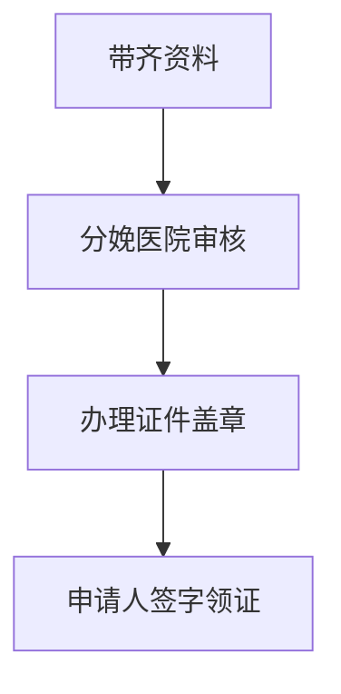
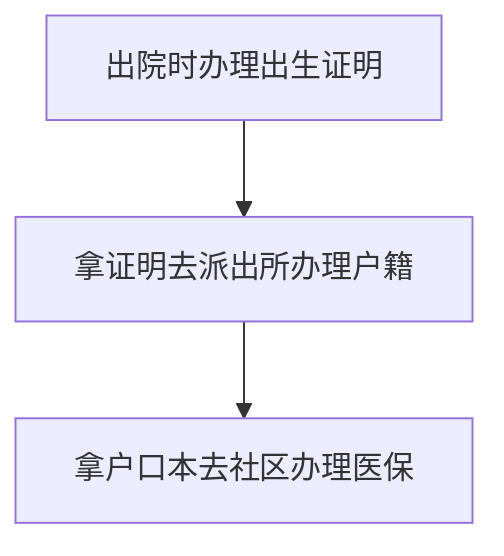

## 出生证明

需要资料：

1. 医院提供的**《出生医学证明 - 首次签发登记表》**
2. 新生儿父母**身份证（户口本）**，原件及复印件；
3. 新生儿起好，上户口的**姓名**（一经打印，不做更改）；
4. 出生**30天内**必须办理；（若超30天，则需提供未按时领取的情况说明）
5. **若领证人不是新生儿母亲**的，还需提供：
   - 新生儿母亲的签字委托书；
   - 新生儿父母身份证原件、复印件；
   - 领证人的本人身份证原件、复印件；

注意事项：

1. 《出生医学证明》由接产医院在婴儿出院前发放；
2. 领证后，及时查看相关信息，如有打印错误应立即让医院重新换发；
3. **后续凭《证明》到婴儿父母一方户籍所在地派出所为婴儿办理户籍登记手续。**

流程：

## 新生儿医保

2022年1月1日起，**新生儿出生90天内**由监护人在**新生儿户籍所在地或居住地的税务部门**，使用新生儿本人**真实姓名和身份证明**缴纳出生当年医疗保险费;待遇享受期为出生之日起至出生当年12月31日。

参保地点：

**户籍（居住证）所属社区或村委会**参加首次基本居民医保

携带资料

1. 新生儿须提供**户口本**；
2. 填写《市城乡居民基本医疗保险参保登记表》

## 总体出生证件办理顺序流程

## 疫苗

**儿童从出生到学龄前期，是免疫系统最脆弱的阶段**，世界上各个国家和地区根据当地的疾病流行情况和经济条件，为该阶段的儿童都制定了不同的免疫规划策略。

及时办理预防接种证：

1. 一般情况下，儿童出生后1个月内，监护人应携带儿童出生时医院提供的《新生儿首剂乙型肝炎（乙肝）疫苗和卡介苗预防接种登记卡》到其居住地预防接种单位建立儿童预防接种证。同时，儿童入托、入园、入学或出境时须查验预防接种证。

我国将疫苗分为两类：

- 政府免费疫苗

  政府免费向公民提供，公民应该依照政府规定受种的疫苗，也称**免费疫苗（官方名字叫“免疫规划疫苗”）**。

  外来儿童和本地儿童享有同样的接种权利，**只要没有禁忌症，都应该及时给孩子接种**。此类疫苗如果不接种，可能会影响宝宝入托、入园、入学。

  > 出生：乙肝疫苗：第1剂，卡介疫苗：第1剂。
  >
  > 1月龄：乙肝疫苗：第2剂。
  >
  > 2月龄：脊灰灭活疫苗：第1剂。
  >
  > 3月龄：口服脊灰减毒疫苗：第2剂，百白破疫苗：第1剂。
  >
  > 4月龄：百白破疫苗：第2剂，口服脊灰减毒疫苗：第3剂。
  >
  > 5月龄：百白破疫苗：第3剂。
  >
  > 6月龄：A群流脑疫苗：第1剂，乙肝疫苗：第3剂。
  >
  > 8月龄：乙脑减毒活疫苗：第1剂，麻风疫苗：第1剂。
  >
  > 9月龄：A群流脑疫苗：第2剂。
  >
  > 18月龄：麻腮风疫苗：第1剂，百白破疫苗：第4剂，甲肝减毒活疫苗：第1剂。
  >
  > 2周岁：乙脑减毒活疫苗：第2剂.
  >
  > 3周岁：A+C群流脑疫苗：第1剂。
  >
  > 4周岁：口服脊灰减毒疫苗：第4剂。
  >
  > 6周岁：A+C群流脑疫苗：第2剂，白破疫苗：第1剂。

  

  

- 自费疫苗

  世界卫生组织最优先推荐儿童接种的疫苗有两种：**肺炎疫苗和流感嗜血杆菌疫苗**（Hib疫苗）。

  我国建议接种的二类疫苗：**流感疫苗、水痘疫苗、手足口疫苗、轮状病毒疫苗等**

  > 流感疫苗类型：
  >
  > 三价灭活流感疫苗：6月龄及以上，0.25ml剂型29元左右，0.5ml剂型65元左右。
  >
  > 三价减毒活流感疫苗：3-17岁人群，每剂298元左右。
  >
  > 四价灭活流感疫苗：3周岁以上人群，每剂128元左右。
  >
  > **强烈推荐每年接种**。容易约不到疫苗。

  

  

### 接种知识点

- 轮状病毒疫苗是口服的；

- 五联和肺炎疫苗首选大腿，两侧大腿都可以。

  我国规定，**一个接种部位只能接种一种疫苗**，如果接种上臂，就会和其他疫苗有冲突。

  为了一次性接种更多疫苗，五联和肺炎接种在大腿上，把上臂让给其他疫苗，这是最佳选择。

- **月龄是年龄段**。

  比如一个小孩是1月1号出生的，他到2月1号，满1月龄，在3月1号之前都叫1月龄，而不是叫2月龄。

- 接种时间**宁可推迟**，也不要提前。

- 观察30分钟

  因为一般疫苗接种后的不良反应都在接种后半小时内，所以一定要在医院观察半小时后再离开。

[自费疫苗介绍]: https://zhuanlan.zhihu.com/p/426450106

